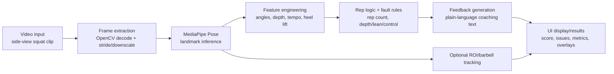

# System Design (MVP)

## MVP Pipeline

## Text Diagram
`video -> decode -> pose keypoints -> smooth -> rep segmentation -> metrics -> fault labels -> feedback -> API response -> frontend tabs/results`

## MediaPipe Outputs Used
The pipeline uses selected MediaPipe Pose landmarks from each frame:
- shoulders (`left_shoulder`, `right_shoulder`)
- hips (`left_hip`, `right_hip`)
- knees (`left_knee`, `right_knee`)
- ankles (`left_ankle`, `right_ankle`)
- heels/toes (`left_heel`, `right_heel`, `left_foot_index`, `right_foot_index`)

Each landmark includes normalized `x`, `y`, `z`, and `visibility`.

## Features Computed
Per-frame and per-rep features include:
- knee angle (left/right average)
- hip angle (left/right average)
- torso lean proxy
- hip-vs-knee vertical depth proxy
- rep duration
- heel-lift from baseline
- knee travel estimate

Optional bar-path/tracking metrics include:
- vertical displacement
- horizontal drift
- path smoothness
- tracking success/loss rates

## Keypoint-to-Feedback Mapping
Fault rules evaluate rep features against fixed thresholds (MVP heuristics):
- insufficient depth
- excessive forward lean
- poor control/tempo
- heel lift

Detected labels are mapped to plain-language coaching cues and optional drill suggestions.

## ROI and Barbell Tracking Integration
The frontend lets the user draw/select an ROI around the barbell sleeve/end-cap. Backend tracking combines tracker-based and fallback methods and returns:
- raw and smoothed bar path
- tracking statistics
- optional CSV/video artifacts

This is **complementary** to pose-based feedback; if tracking fails, pose-based analysis still provides form results.

### ROI Selection States (Frontend UX)
- Upload video
- Preview video
- Pause at target frame
- Select **Initial ROI** around barbell end-cap
- Confirm ROI
- Start KCF tracking
- Processing
- Results ready (shows **Tracked ROI + bar path**)
- Tracking failed with reason (graceful error message)

### API Endpoints for ROI Tracking
- `POST /api/analyze/upload-tracker-video`: stores upload + returns metadata (`fps`, duration, frame size, frame count).
- `GET /api/video/frame?video_id=<id>&time=<seconds>`: returns exact decoded preview frame.
- `POST /api/track/barbell`: initializes KCF at `start_time` with pixel ROI and returns processed output URL, path points, success rate, warnings.

### Coordinate Mapping
When the preview video is scaled in the browser, ROI coordinates are converted back to natural video pixels before API submission:
- `scaleX = video.videoWidth / displayedWidth`
- `scaleY = video.videoHeight / displayedHeight`
- `naturalX = displayedX * scaleX`
- `naturalY = displayedY * scaleY`
- `naturalW = displayedW * scaleX`
- `naturalH = displayedH * scaleY`

## Thresholds/Rules (MVP)
The current implementation uses lightweight, deterministic rules rather than a learned classifier. This is appropriate for MVP because it is:
- explainable for class demos
- lightweight for local compute
- easier to debug under time constraints

## Pose Tracking vs Object/Barbell Tracking
- **Pose tracking**: estimates human body keypoints (joints) from each frame to reason about movement mechanics.
- **Barbell/object tracking**: tracks the selected barbell region/point across frames to evaluate path quality.

They answer different questions:
- Pose: “How is the lifter moving?”
- Object tracking: “How is the bar moving?”

## MVP Appropriateness
This architecture aligns with course MVP goals:
- demonstrable end-to-end pipeline (input → processing → meaningful output)
- clear modular implementation
- easy extension path to future learned models if needed

## Tracking Limitations
- KCF can lose target under motion blur, occlusion, or major lighting shifts.
- Side-view clips are strongly preferred.
- User must select ROI tightly around the barbell end-cap for best results.
